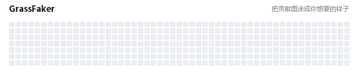

# 🎨 GrassFaker

把 GitHub 贡献图涂成你想要的样子。*The honest way to look busy on GitHub.*

一个纯前端的小玩具：一键全绿、按日期区间变色、随机深浅、打印文字（`LOVE` / `520` …）和像素模板，随时清空或还原。所有改动只发生在你本机浏览器里，不影响真实提交、服务器无感知、别人也看不到——就图一乐。

## 功能

- **色阶 0–4**：五个档位，`4` = 最深绿。
- **全部变此色阶**：一键把整张图涂成指定深浅。
- **区间变色**：指定「从某天到某天」，只改范围内的格子。
- **随机**：设定深浅范围（如 2~4），全部或区间随机，看起来更自然。
- **模板打印**：内置 `LOVE` / `HELLO` / `HI` / `520` / `1314` / `LOL` / `GOOD` / `COOL` / `❤`。
- **自定义文字**：任意英文/数字，用内置 5×7 像素字体打印。
- **清空全部**：整张图置空。
- **还原**：一键回到真实贡献数据（原始色阶在本地备份）。

## 安装

1. 装好 [Tampermonkey](https://www.tampermonkey.net/)。
2. 打开 `grassfaker.user.js`（或把文件拖进浏览器 / 手动新建脚本粘贴内容）。
3. 打开你的主页 `github.com/你的用户名`，右上角出现 🎨 面板即可使用。

> 面板可拖动；`—` 折叠、`✕` 关闭（关闭后右下角留一个 🎨 圆点可重新打开）。

## 说明

- 仅修改本地 DOM 的 `data-level` 属性，刷新即还原；不写任何数据到 GitHub。
- 模板「文字型」依赖内置 5×7 字体（仅 A–Z、0–9）；中文/特殊图案请用像素 `rows` 形式。
- 区间 / 打印依赖格子上的日期属性；若 GitHub 改版导致日期识别失败，相应功能会自动禁用并提示。

## License

仅供娱乐。
